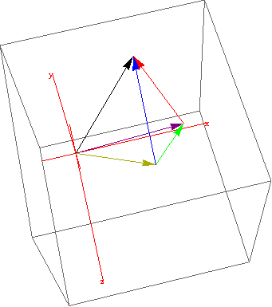

# Introduction to Linear Models {#Chpt6}

This is just a brief, 4 lesson, introduction to linear models and in particular linear regression.  This chapter is an excellent chapter and it is unfortunate these is not enough time to cover the entire chapter.  The linear algebra approach does take some time to introduce to the students and thus I spend an entire lesson on section 6.1.

## Introduction to Linear Models {#L29}


### Objectives  

1. Know and use all new terms for the linear model framework  
2. Use R or linear algebra to find various vectors or matrices needed in simple linear regression  
3. Create model using R formulas


### Linear Regression  

A more powerful way to conduct analysis is to consider a response variable, typically called $Y$, output, or dependent, and one or more predictor variables, typically called $X$ or input, independent, explanatory. Then from a model perspective, the following relationship is explored
$$Y=f(X_{1},X_{2},X_{3}, ...,X_{p})+\epsilon$$
where $\epsilon$ is the error and $E[\epsilon]=0$.

The goal is to determine $f$ and many techniques have been developed.  One of the oldest and most successful is to assume that $f$ is linear.  That is 
$$f(X_{1},X_{2},X_{3}, ...,X_{p})=\beta_{0}+\beta_{1}X_{1}+\beta_{2}X_{2}+...+\beta_{p}X_{p}$$

This model has $p+1$ parameters denoted by $\beta_{i}$.  Note that it is linear in the parameters and not in the dependent variables.  The following is a linear model:
$$Y=\beta_{0}+\beta_{1}X_{1}+\beta_{2}X_{2}^{2}+\epsilon$$

Finding the parameters $\beta$ is a linear algebra problem.  Before explaining the linear algebra, let's look at a couple of examples to demonstrate the power of this model.

### Examples

From the `fastR` package, consider the `gpa` data set.

```{r eval=FALSE}
library(fastR)
```  

```{r}
summary(gpa)
head(gpa)
```

Using R and its model notation, consider the model

```{r}
lm(act~1,data=gpa)
```

Notice that this gave us a model where the function is a constant, in this case the mean.

The model matrix will be a column vector of one's.

```{r}
head(model.matrix(lm(act~1,data=gpa)),n=20)
```

Likewise we could explore a relationship between two continuous variables

```{r}
lm(gpa~act,data=gpa)
```

This model suggests that
$$GPA=1.5+.07*ACT+\epsilon$$

The model matrix is
```{r}
head(model.matrix(lm(gpa~act,data=gpa)),n=20)
```

The predicted values are
```{r}
head(lm(gpa~act,data=gpa)$fitted,n=20)
```

And the residuals, the difference between observed and predicted are
```{r}
head(lm(gpa~act,data=gpa)$residuals,n=20)
```

```{r}
histogram(lm(gpa~act,data=gpa)$residuals)
```

As another example, consider the baseball batting data set

```{r}
summary(batting)
```

This model will give us the average hits for each league

```{r}
lm(H~league,data=batting)
```  

```{r}
33.485-1.162
```  

```{r}
tapply(batting$H,batting$league,mean)
``` 

### Least Squares  

The parameters are found by minimizing the sum of the residuals squared.  That is we want to find the difference between the observed and predicted, square the values to make sure all values are positive, and sum the values.  This is our objective function and we want to find the values $\beta$ that minimize this metric.  This metric was developed because it has nice mathematical properties.  In particular it is quadratic and thus has a nice closed form solution for the minimum.  We will explore this in the next lesson.

Section 6-1 Additional Problems:

1.  Verify the relationship in equation 6.5 of your text.  Note: you will have to use properties of the inner product, see C.2.


2.  Suppose that SATM and SATV, these variables are explained in the reading, are used to predict gpa.  Write the model formula that correspond to the following R commands:
	a) lm(gpa~I(SATV+SATM))

	b) lm(gpa~SATV+SATM)


3.  Let y ⃑=〈1,2,0〉 be the response and (x_1 ) ⃑=〈1,2,3〉 the predictor.  These are used to create a linear model with an intercept.  Answer the following questions using matrices and vectors:
	a)  Write the design matrix
  b)  Find the vector of fitted values.  Using the following commands in R will give you the intercept and slope.  Make these values a vector and use linear algebra to find the solution.
    (Prob6.1<-data.frame(y=c(1,2,0),x=c(1,2,3)))
     lm(y~x,Prob6.1)
	c)  Find the vector of residuals
	d)  Find the vector of effects
	e)  Find the vector of variance
	f)  Show that the vectors in parts c and d are orthogonal 
g)  Show that the vector in part e is the sum of the vectors in parts c and d.


Here is a vector view of the third problem on the handout.

 

Here is a different view of the data

```{r}
x<-c(1,2,3)
y<-c(1,2,0)
plot(x,y)
lm(y~x)
abline(a=2,b=-.5)
points(x,lm(y~x)$fitted,col="red")
``` 

Or using a data frame

```{r}
(Prob6.1<-data.frame(y=c(1,2,0),x=c(1,2,3)))
lm(y~x,Prob6.1)
lm(y~x,Prob6.1)$fitted
lm(y~x,Prob6.1)$residual
```  

## Simple Linear Regression  {#L30}

### Objectives  

1. Find simple linear regression coefficients using least square, maximum likelihood, and linear algebra  
2. Fit a simple linear regression model in R; find coefficients, fitted values, and plot results  
3. Interpret the regression coefficients in the context of the problem

### Review  

Using the data from last lesson, let's look at the regression problem from three different perspectives.  First if we plot the data

```{r}
x<-c(1,2,3)
y<-c(1,2,0)
plot(x,y)
lm(y~x)
abline(a=2,b=-.5)
# abline(lm(y~x)) also works
points(x,lm(y~x)$fitted,col="red")
```

or using the lattice package

```{r eval=FALSE}
library(lattice)
```

```{r}
xyplot(y~x,type=c("p","r"))
```

In this situation we want the best line, the line that minimizes the sum of the squared errors, of the form $y=\beta_{0}+\beta_{1}x$.

Another perspective is to solve an over-determined set of linear equations
$$1=\beta_{0}+1\beta_{1}$$
$$2=\beta_{0}+2\beta_{1}$$
$$0=\beta_{0}+3\beta_{1}$$

And finally, similar but using matrices and vectors, solving
$$\left( \begin{array}{c} 1 \\ 2 \\ 0 \end{array} \right) = \left( \begin{array}{cc} 1 & 1 \\ 1 & 2 \\ 1 & 3 \end{array} \right)\left( \begin{array}{c} \beta_{0} \\ \beta_{1} \end{array} \right)$$

### Estimating parameters  

We find estimates for $\beta_{0}$ and $\beta_{1}$ by minimizing the sum of squared errors.  This metric was selected because it is a quadratic and has nice properties when you minimize it.

The sum of square errors is
$$\sum_{i}(y_{i}-\hat{y}_{i})^2=\sum_{i}(y_{i}-\beta_{0}-\beta_{1}x_{i})^2$$

Taking the derivative and setting equal to zero yields
$$\hat{\beta}_{1}={\sum_{i} (y_{i}-\bar{y})x_{i} \over \sum_{i} (x_{i}-\bar{x})x_{i}}$$
$$\hat{\beta}_{0}=\bar{y}-\hat{\beta}_{1}\bar{x}$$

for our problem
```{r}
(beta1<-sum((y-mean(y))*x)/sum((x-mean(x))*x))
(beta0<-mean(y)-beta1*mean(x))
```

Using linear algebra
$$\vec{Y}=X\vec{\beta}$$
$$X^{T}\vec{Y}=X^{T}X\vec{\beta}$$
$$\vec{\beta}=(X^{T}X)^{-1}X^{T}\vec{Y}$$

Note that the columns of the model matrix must be linearly independent for the inverse to exist.  The estimates of $Y$ are
$$\vec{\hat{Y}}=X(X^{T}X)^{-1}X^{T}\vec{Y}$$ 
where $X(X^{T}X)^{-1}X^{T}$ is called the hat matrix.

```{r}
(X<-as.matrix(cbind(1,x)))
solve(t(X)%*%X)%*%t(X)%*%y
X%*%solve(t(X)%*%X)%*%t(X)%*%y
```  

Note that the interpretation of the slope coefficient is the change in the average value of $y$ for one unit of change in $x$.

For maximum likelihood, we need a distribution for the error term.  This is not needed for the methods above.  If we assume the errors are independent and identically distributed from a normal with mean 0 and standard deviation $\sigma$, then the maximum likelihood estimates are
$$\hat{\beta}_{1}={\sum_{i} (y_{i}-\bar{y})x_{i} \over \sum_{i} (x_{i}-\bar{x})x_{i}}$$
$$\hat{\beta}_{0}=\bar{y}-\hat{\beta}_{1}\bar{x}$$
$$\hat{\sigma^{2}}={\sum_{i}e_{i}^2 \over n}$$

The variance estimate is biased.  An unbiased estimate divides by $n-2$.

### In R

We can compute all this information in R.

```{r}
lm(y~x)
summary(lm(y~x))
names(lm(y~x))
names(summary(lm(y~x)))
fitted(lm(y~x))
residuals(lm(y~x))
```

Thus the maximum likelihood estimate of $\sigma$ is

```{r}
sqrt(sum(residuals(lm(y~x))^2)/3)
(summary(lm(y~x))$sigma)*sqrt(1/3)
```

Try Prob 6.4 and 6.5

## Inference for Simple Linear Regression {#L31}

### Objectives  

1. Conduct and interpret a hypothesis test and confidence interval for the slope of a simple linear regression  
2. Find and interpret a confidence interval and prediction interval for the estimated response  
3. Construct and interpret an ANOVA, analysis of variance, table to also include the coefficient of determinism  

### Inference for Regression Model Slope 

In regression we are typically interested in inference for the slope coefficient and the predicted values.  Inference could be in the form of a hypothesis test or confidence interval.  We could also perform inference for the intercept but this is not common because the intercept is typically not relevant to the context of the problem.  For example, if we have weight and height data on males and want to build a model with weight as the response and height as the predictor.  The intercept has the interpretation of being the weight of a male who has no height.  It is not relevant to the problem.

To perform inference for the predicted/fitted values and the slope we need their probability distributions.  Since the model has the form 
$$ Y=\beta_{0}+\beta_{1}X+\epsilon$$
we really need the distribution of $\epsilon$, the errors.  If the errors are normally distributed, then the slope and intercept estimators from least squared regression are normally distributed and in fact are unbiased.  The inference problems for the slope then become similar to inference for a mean.  Thus if the variance is not known, as is often the case, we will use a t distribution.  The big difference from testing a mean is that the degrees of freedom is $n-2$ for simple linear regression.  

As an example, let's consider the problem we have been working
```{r}
x<-c(1,2,3)
y<-c(1,2,0)
```

The standard error of the slope is
$${s \over \sqrt{\sum{(x_{i}-\bar{x})^{2}}}}$$

where $s$ is an estimate of the standard deviation.  It is important to note the standard error depends on the distribution of the $x$ values.  In a designed experiment, we typically pick $x$ values at the endpoints of the region of interest.  This will make the denominator large and thus the standard error small.  

For this problem the estimate of the slope is -0.5 and the estimate of the intercept is 2.0.  The predicted values are

```{r}
X<-cbind(1,x)
beta<-c(2.0,-.5)
(yhat<-as.vector(X%*%beta))
```


```{r}
s<-sqrt(sum((yhat-y)^2)/(3-2))
(slopese<-s/sqrt(sum((x-mean(x))^2)))
```

To test the hypothesis that the slope is zero, that is that x is not correlated with y
$$H_{0}:\beta_{1}=0$$
$$H_{1}:\beta_{1}\neq 0$$

The test statistic is
$$t={\hat{\beta}_{1} - \beta_{H_{0}} \over SE(\hat{\beta}_{1})}$$
or
```{r}
(tstat<-(-.5 - 0)/slopese)
```
and the p-value is  

```{r}
2*pt(tstat,1)
```

Thus we fail to reject to the null hypothesis.

This is the same as the output from the `lm` function in R.
```{r}
summary(lm(y~x))
```

However, if we want to test

$$H_{0}:\beta_{1}=-.75$$
$$H_{1}:\beta_{1}\neq -.75$$

then we would have to generate our own p-value but we could use the values from the output `lm`.

```{r}
(tstat<-(-.5 - (-.75))/summary(lm(y~x))$coefficients[2,2])
2*(1-pt(tstat,1))
```

Confidence intervals can be generated as follows
$$\hat{\beta}_{1} \pm t_{(1-{\alpha \over 2},n-2)} SE(\hat{\beta}_{1})$$

```{r}
-.5+c(-1,1)*qt(.975,1)*slopese
```


or
```{r}
confint(lm(y~x))
```

Since zero is in the confidence interval, we fail to reject the hypothesis that the slope is zero.

### Inference for Regression Model Predicted Values

Remember that the predicted values from the regression model are average values.  We typically want to form prediction intervals for both the average value and an individual value for a given x value.  These intervals again will be form as above using the t distribution but the standard errors are more difficult to determine.  We will use software to this portion.

For our example, assume we want to form a 90% prediction interval for the average value of y when x equals 1.5.  The interval is
```{r}
(simple_model<-lm(y~x))
predict(simple_model,newdata=data.frame(x=1.5),interval="confidence",level=.9)
```

Note that we need to send a data.frame to the function even though we only had one value.  This is because the function allows us to send multiple values.  The interpretation is that we are 90% confident that the average value of y is between -3.99 and 6.49 when x equals 1.5.

As an example of multiple values
```{r}
predict(simple_model,newdata=data.frame(x=c(1,2,3)),interval="confidence",level=.9)
```  

If we want an interval for a single value of y, we would use
```{r}
predict(simple_model,newdata=data.frame(x=1.5),interval="prediction",level=.9)
```  

Notice that this interval is wider than the interval for the average value of y as we would expect since it is for a single value.  The interpretation is that we are 90% confident the next value of y will be between -8.09 and 10.59 when x is 1.5.

### ANOVA  

We saw the results from R using the linear model function, `lm`, was
```{r}
summary(lm(y~x))
``` 

There is some additional information to cover in the output.  The output in the coefficients section provides the estimates of the intercept and slope, their standard errors, and test statistics and p-values for testing that these estimates are zero.  The bottom portion provides some additional information.  The residual standard error is an estimate of the standard deviation of the errors.  It is also called the square root of the mean squared errors.  Thus MSE, mean squared errors, is
$$MSE={\sum_{i}(y_{i}-\hat{y}_{i})^{2} \over n-2}$$.

The multiple R-squared is a ratio of the SSM, sum of squares model, over SST, sum of square total, where
$$SSM=\sum_{i}(\hat{y}_{i}-\bar{y})^{2} $$
$$SST=\sum_{i}(y_{i}-\bar{y})^{2}$$

The sum of squares total is the variance in y.  The sum of squares model is the variance explained by the model.  Thus R-squared is the proportion of total variance explained by the model.  This is a useful metric.  We will not discuss the adjusted R-squared but it is a penalized version of the R-squared.

```{r}
(SST<-sum((y-mean(y))^2))
(SSM<-sum((yhat-mean(y))^2))
SSM/SST
```

The F-statistic simultaneous tests all the slope coefficients being equal to zero, which is helpful if we have multiple predictors.  Since we only have one predictor, the p-value associated with the F-statistic is the same as the p-value for testing that the slope is zero.  The F-statistic is the ratio of the mean squares for the model over the mean squares for the errors.  Note that the sum of squares for the model and error as well as their degrees of freedom must add to the sum of squares total.  The degrees of freedom for the mean squares total is n-1, this is because we are calculating a variance for y.

```{r}
(SSE<-sum((y-yhat)^2))
SSE+SSM
SST
```

The F-statistic is
```{r}
(SSM/1)/(SSE/(3-2))
``` 

And the p-value

```{r}
2*pf((SSM/1)/(SSE/(3-2)),1,1)
```

Sometimes this same information is summarized in an ANOVA table.

```{r}
anova(lm(y~x))
```

To assess the fit of the model, people use the p-value(s) for the slope, the F-statistic, and the R-squared values.

### Example  

Using the `gpa` from `fastR`, we could see if there is a linear relationship between total SAT score and gpa.

```{r eval=FALSE}
library(fastR)
```


```{r}
head(gpa)
```

```{r}
summary(lm(gpa~I(satm+satv),data=gpa))
```

```{r}
confint(lm(gpa~I(satm+satv),data=gpa),level=.9)
```

For a given set of scores on the SAT, we can generate a confidence interval for the average gpa and a prediction interval for an individual with those scores.
```{r}
predict(lm(gpa~I(satm+satv),data=gpa),newdata=data.frame(satm=600,satv=600),interval="confidence",level=.9)
```


```{r}
predict(lm(gpa~I(satm+satv),data=gpa),newdata=data.frame(satm=600,satv=600),interval="prediction",level=.9)
```

Notice that the prediction interval is wider.

## Regression Diagnosics {#L32} 

### Objective

Generate diagnostic plots to check for  
i. Normality  
ii. Equal variance  
iii. Outliers  
iv. Quality of fit  


### Review  

The linear regression model assumes that the errors are  
1. Independent  
2. Normally distributed  
3. Constant variance (homoskedastic)  

In this section we will test these assumptions.

We are also assuming that a linear fit is appropriate, so we need to check this assumption.  

Finally we need to check for observations that may have a large influence on the model.  These are sometimes called outliers.

### Assumptions about the Errors  

To understand the assumptions, let's simulate data and then explore tools to evaluate the assumptions.  

We will first build a data set where
$$y=2x+\epsilon$$
where
$$\epsilon \sim N(0,1.5)$$

```{r}
set.seed(1282015)
(x<-sort(runif(40,min=1,max=10)))
set.seed(2)
(error<-rnorm(40,0,1.5))
(y<-2*x+error)
plot(x,y)
``` 

Independence is difficult to evaluate and can typically only be done if the data is collected in an experiment and there is a time element.  For example, if our data were collected so that the first value was `r x[1]` and the last value collected at a latter time was `r x[40]`.  Then we could check for independence by plotting the x-values, ordered by time, against the residuals.  Again, in an observational study this is not possible but in an experiment it is.  For our understanding, we will treat the simulated data as an experiment and check for independence.

First we build the model.

```{r}
modles40<-lm(y~x)
summary(modles40)
```  

Then plot the x-values versus the residuals.

```{r}
plot(residuals(modles40)~x)
```  

If independence is not a valid assumption, then we would see a pattern in the plot.  We do not see any pattern here.  Some examples of patterns are a learning curve, where variance decreases or the slope changes, environmental effects such as heat or humidity which change during the day, or some change in the variable such as a different testing machine.

A similar plot which is more common, is to plot the fitted values against the residuals.

```{r}
plot(residuals(modles40)~fitted(modles40))
```  

To help us understand a lack of independence, let's put a shift in the data after 20 data points have been observed.

```{r}
y2<-y
y2[21:40]<-y2[21:40]+10
plot(x,y2)
summary(lm(y2~x))
plot(residuals(lm(y2~x))~x)
plot(residuals(lm(y2~x))~fitted(lm(y2~x)))
```  

From the plot, it should be clear that the residuals are not in a random pattern, there is a dependency.  You could in this simulation, introduce other types of dependencies.  

The plot of residuals turns out to be one of the best diagnostic tools.  We can also use it to check for constant variance as well as the quality of the linear fit.

Next, going back to our original data, let's let the variance decrease as the x-values increase.

```{r}
(error2<-error/(5*x))
(y3<-2*x+error2)
plot(x,y3)
``` 


```{r}
plot(residuals(lm(y3~x))~fitted(lm(y3~x)))
```

Notice how the spread of the residuals decreases as the fitted values get larger, this is an indication that variance is not constant.

Now let's change the underlying model to not be linear and look at the residual plot.

```{r}
(y4<-x^4+error)
plot(x,y4)
```

```{r}
plot(residuals(lm(y4~x))~fitted(lm(y4~x)))
```

The plot indicates that there is a non-linear relationship between x and y.

Normality can be checked using a qq-plot.

```{r}
xqqmath(residuals(modles40))
```  

We have discussed this plot in detail in a previous lesson.

Often instead of using the residuals to check assumptions, standardized residuals are used.  This is done to remove the bias that an interpreter of the plot may have just based on the size of the residuals.  The easiest standardization is to divide the residuals by the estimate of standard error.  The second method is called the studentized residual which accounts for the fact that the variance of the residual depends on the hat matrix.  This second standardization is the most common.

### Outliers, Leverage, and Influence  

An outlier can be an observed value that is much different than the predicted value or a value of the predictor that is much different than the other predictor values.  The second type is called a leverage point.  The first simply an outlier.  Outliers should be investigated to make sure there was not a data recording error or measurement error.  Be careful about simply deleting them.  There must be a reason to remove it other than it is an outlier.

Outliers in the response are again found from the residual plot.

Leverage can be measured by looking at the impact an observation has on the slope.  This is done by calculating the slope without the observation and then with the observation and looking at the difference in slopes.  This is called DFBETA, difference in the beta.  We can also standardize it so that we can easily compare across data sets.

```{r eval=FALSE}
library(car)
```  

```{r dfbeta,fig.cap="Impact of Each Observation on the Slope Using DFBETA"}
dfbetaPlots(modles40,ylim=c(.15,-.15),xlab = "Observation Number",ylab = "DFBeta")
```  

Figure \@ref(fig:dfbeta) illustrates how each observation impacts the slope.  The dotted lines above and below the origin are one standard deviation.  None of the values seem extreme.  We could also standardize the output by using DFBETAS.

```{r dfbetas,fig.cap="Impact of Each Observation on the Slope Using DFBETAs"}
dfbetasPlots(modles40,ylim=c(1.1,-1.1),xlab = "Observation Number",ylab = "DFBetas")
```  

Figure \@ref(fig:dfbetas) is standardized and the dotted line is at positive and negative 1.  Again, there are no points with high leverage.

Another measure of leverage is to take the value from the hat matrix and compare it with $2p/n$ where $p$ is the number of parameters.  This is simply called leverage.

Influence is determined by how much the fitted values depend on an observation.  We could calculate the difference between the fitted values with the observation in the model and without removed.  This is called DFFIT.  It can also be standardized.

The second measure of influence is called Cook's Distance.  It measures the difference in all the observed and predicted values with the observation removed.  It is a vector distance squared.  It also gets standardized by the variance and number of parameters.  A value in excess of 1 is a concern.

Luckily, R has plots and functions for all of these measures.

```{r}
par(mfrow=c(2,3))
plot(modles40,w=1:6)
par(mfrow=c(1,1))
```  

### Example  

In the library Stat2Data, there is a data set that has the price of a Porsche and its mileage.  We will build a linear model and test the assumptions.

```{r eval=FALSE}
library(Stat2Data)
library(fastR)
library(DT)
```  

```{r}
data(PorschePrice)
head(PorschePrice)
```

Instead of using `head` we can use a datatable which creates an html widget to examine the data.  

```{r}
DT::datatable(PorschePrice)
```

```{r}
xyplot(Price~Mileage,data=PorschePrice,type=c("p","r"))
summary(lm(Price~Mileage,data=PorschePrice))
```

Checking the assumptions.

```{r}
par(mfrow=c(2,3))
plot(lm(Price~Mileage,data=PorschePrice),w=1:6)
par(mfrow=c(1,1))
```  

```{r}
plot(cooks.distance(lm(Price~Mileage,data=PorschePrice)))
```

What are your conclusions from these plots?